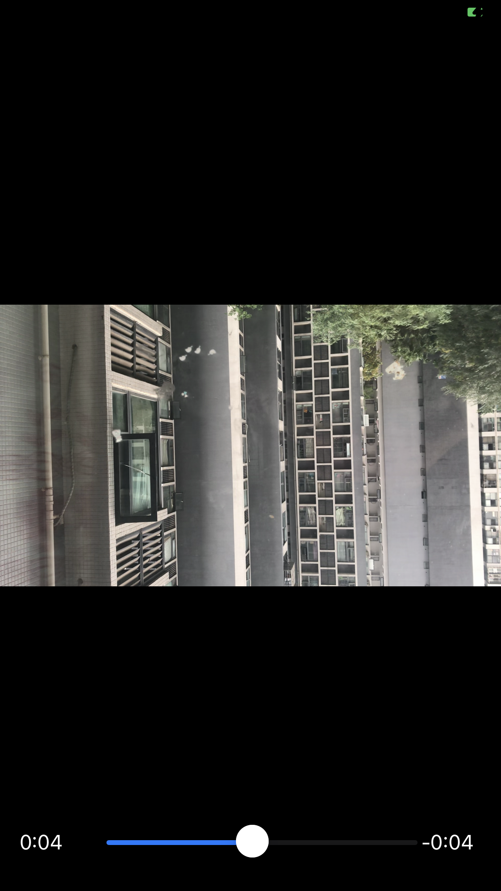

# ffmepg-iOS
This is a demo for displaying videos on the iOS platform using FFmpeg.

# Open video file,and retrieve stream information
```
 if (avformat_open_input(&formatCtx, [path cStringUsingEncoding: NSUTF8StringEncoding], NULL, NULL) < 0) {
        if (formatCtx) avformat_free_context(formatCtx);
        return MovieErrorOpenFile;
    }
    
        if (avformat_find_stream_info(formatCtx, NULL) < 0) {
        avformat_close_input(&formatCtx);
        return MovieErrorStreamInfoNotFound;
    }
```
# Find the video stream
```
- (MovieError)openVideoStream: (NSInteger)videoStream{
    AVCodecParameters *codecpar = _formatContext->streams[videoStream]->codecpar;
    const AVCodec *codec = avcodec_find_decoder(codecpar->codec_id);
    AVCodecContext *codec_ctx = avcodec_alloc_context3(codec);
    avcodec_parameters_to_context(codec_ctx, codecpar);
    AVCodecContext *codecCtx = codec_ctx;
    
    if (!codec) return MovieErrorCodecNotFound;
    if (avcodec_open2(codecCtx, codec, NULL) < 0) return MovieErrorOpenCodec;
    _videoFrame = av_frame_alloc();
    if (!_videoFrame) {
        avcodec_close(codecCtx);
        return MovieErrorAllocateFrame;
    }
    _videoStream = videoStream;
    _videoCodecCtx = codecCtx;
    
    AVStream *st = _formatContext->streams[_videoStream];
    avStreamFPSTimeBase(st, 0.04, &_fps, &_videoTimeBase);
    
    return MovieErrorNone;
}
```
效果图


# License
本项目基于MIT协议开源。